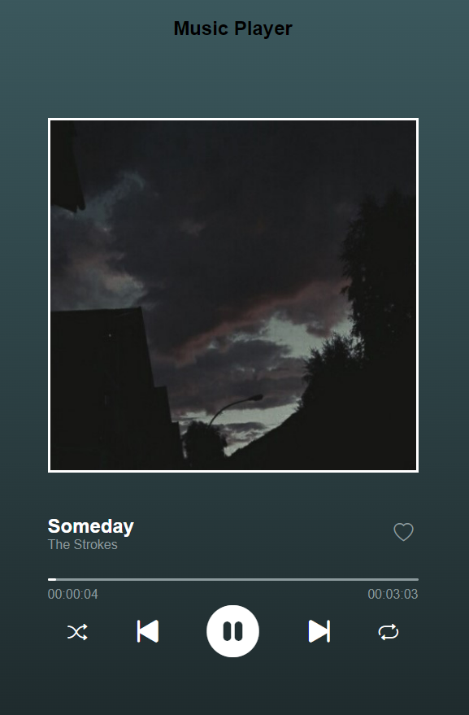

# Player_Música

- Esse projeto é um player de música: que carrega, randomiza, para, dá play, cria um loop da mesma música, gerencia e apresenta o tempo corrido e o tempo que falta das musica, de forma relativamente semelhante ao "Spotify".

- O arquivo de execussão é o `index.html`.

- O output é a página `Document`, aberta pelo browser.

## Preview

- Print do output da página no browser como exemplo:

<!DOCTYPE html>
<html lang="en">
<head>
    <meta charset="UTF-8">
    <meta http-equiv="X-UA-Compatible" content="IE=edge">
    <meta name="viewport" content="width=device-width, initial-scale=1.0">
</head>
<body>
    

        </img>
    

</body>
</html>

## Ferramentas Utilizadas

- Bootstrap.

# In English

# Music_Player

- This project is a music player, which: loads, randomizes, stops, plays, creates a loop of the same music, manages and presents the elapsed time and the remaining time of the songs. Is relatively similar to "Spotify".

- The execution file is `index.html`.

- The output is the `Document` page, opened by the browser.

## Preview

- Print the output of the page in the browser as an example:

## Used Tools

- Bootstrap.
